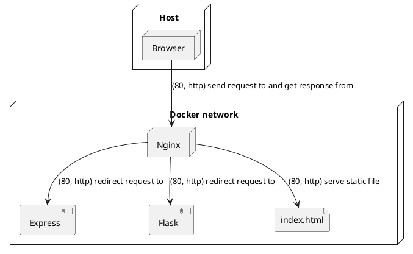

# Nginx demo
Het doel van deze demo is om een nginx server op te zetten met een loadbalancer en een reverse proxy. De loadbalancer zal de requests verdelen over de twee verschillende web servers. De gehele omgeving zal in verschillende docker containers draaien.

## Uiteindelijke architectuur


## Losse onderdelen uitvoeren:
```bash
$ cd Express # or cd Flask
$ docker build -t webserver . && docker run -p 80:80 webserver # build and run the docker container
# --- OR ---
$ docker compose down ; docker compose up --build -d; docker compose logs -f # build, run and follow the logs
```

## Stappenplan
1. Maak een nginx server
2. Zorg er voor dat de nginx server de index.html file serveert
3. Voeg webserver 1 toe aan de nginx server
4. Voeg webserver 2 toe aan de nginx server
5. Zorg er voor dat de nginx server alleen request doorstuurt naar de webserver wanneer de request naar /api gaat
6. Zorg er voor dat de nginx server de requests verdeelt over de twee webservers en test dit met een load test(localhost:8080)
7. Voeg caching toe aan de /api/time route, zorg er voor dat de cache 1 minuut geldig is