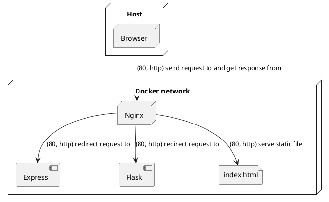

# Nginx demo
Het doel van deze demo is om een nginx server op te zetten met een loadbalancer en een reverse proxy. De loadbalancer zal de requests verdelen over de twee verschillende web servers. De gehele omgeving zal in een docker container draaien.

## Uiteindelijke architectuur


## Losse onderdelen uitvoeren:
```bash
$ cd Express # or cd Flask
$ docker build -t webserver . && docker run -p 80:80 webserver # build and run the docker container
```